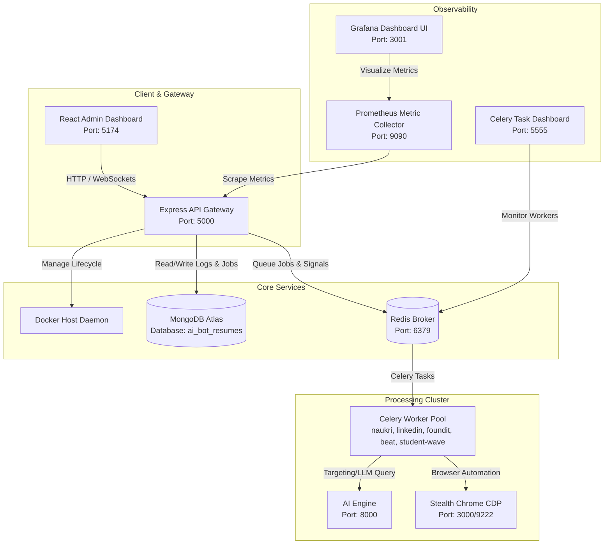
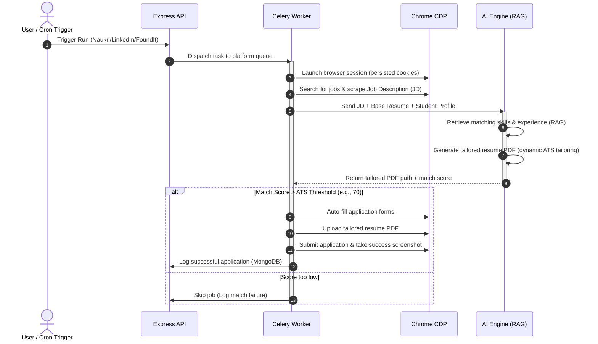

# 🚀 AI Job Automation System v2
An enterprise-grade, fully containerized, autonomous job application pipeline. The system uses a RAG-based AI agent to auto-tailor resumes, extract job descriptions, bypass anti-bot mechanisms using a stealth browser cluster, and auto-apply to positions on platforms like **LinkedIn**, **Naukri**, and **FoundIt**.

---

## 🏗️ System Architecture & Workflow

The system is designed as a distributed microservice architecture managed via Docker. It consists of a React frontend, an Express gateway, a centralized Redis queue, Celery task workers, and dedicated monitoring tools.



---

## ⚡ The Core Automation Flow

Every automatic run executes the following high-level pipeline:



---

## 📦 Container Registry (18 Microservices)

| Container Name | Port | Description |
| :--- | :--- | :--- |
| `job-automation-admin-dashboard-v2` | `5174:80` | Production React static frontend served via Nginx. |
| `job-automation-api-v2` | `5000:5000` | Gateway node API managing queues, DB access, and container states. |
| `job-automation-redis-v2` | `6379:6379` | In-memory message broker coordinating Celery workers. |
| `job-automation-ai-engine-v2` | `8000:8000` | Python Fast API running RAG indexing, skill scoring, and resume PDFs generation. |
| `job-automation-chrome-cdp-v2` | `3000/9222` | Headless Google Chrome cluster built with anti-bot evasion hooks. |
| `job-automation-prometheus-v2` | `9090:9090` | Time-series database gathering API and queue performance metrics. |
| `job-automation-grafana-v2` | `3001:3000` | Rich dashboard interface visualising application rates and success indicators. |
| `job-automation-flower-v2` | `5555:5555` | Real-time celery task progression and health monitor. |
| **Worker Pools** (`celery-*`) | Internals | Specialized headless processors (`celery-linkedin-1-v2`, `celery-naukri-1-v2`, etc.) |

---

## 🛠️ Getting Started (3-Step Setup)

### Prerequisites
*   [Docker Desktop](https://www.docker.com/products/docker-desktop/) (Running)
*   Node.js v18+ & NPM (For local frontend development if not using Docker)

### Step 1: Initialize Configuration
Copy `.env.example` into a new `.env` file in the root directory and update your secrets:
```bash
cp .env.example .env
```
Ensure you provide your target platform login credentials, LLM Provider keys (Groq/OpenRouter), and MongoDB connection URI.

### Step 2: Spin Up the Infrastructure
Start the orchestrator gateway and core DB/broker services using the Windows helper or docker directly:
```bash
# Using the Windows helper script:
.\start.bat

# Or run directly via Compose:
cd job_automation_system
docker compose up -d redis api admin-dashboard chrome-cdp ai-engine prometheus grafana flower
```

### Step 3: Run Automation from Dashboard
1.  Navigate to the UI at **`http://localhost:5174`**
2.  Click the **START** button to initialize the Celery worker nodes.
3.  Click **RUN NOW** to instantly trigger a pipeline run, or configure the auto-scheduling cron parameters.

---

## 📈 System Monitoring & Metrics

*   **Celery Workers Dashboard (Flower)**: Accessible at `http://localhost:5555`. Excellent for inspecting active tasks, execution times, and failure stack traces.
*   **System Analytics (Grafana)**: Accessible at `http://localhost:3001` (User: `admin` / Password: Configured in `.env`). Custom charts tracking:
    *   Application success rates.
    *   Failed vs. skipped jobs (due to low ATS scores).
    *   Worker CPU/Memory load.

---

## 🤝 Project Structure
```text
ai-bot-resumes/
├── admin-dashboard/            # React frontend (Vite)
├── ai_engine/                  # FastAPI service for LLM & RAG resume tailoring
├── job_automation_system/      # Orchestration, Celery tasks, docker configurations
│   ├── tasks/                  # Platform task runners (linkedin, naukri, foundit)
│   ├── utils/                  # DB connection helpers, logger, path contracts
│   └── docker-compose.yml      # Root service orchestrator config
├── docs/                       # Technical specs & documentation
├── temp_resumes/               # Local bind-mounted PDF outputs
├── start.bat                   # Windows initialization helper
├── .gitignore                  # Production-level ignore lists
└── README.md                   # System guide (This file)
```

---

## 🛡️ Evasion & Safety Safeguards
*   **Anti-Bot Evasion**: The browser cluster mimics natural cursor paths, human delays, randomly adjusts viewport bounds, and persists real-world session data.
*   **Safe Apply Caps**: Daily quotas are hard-coded to protect your accounts (e.g., maximum 32 applications per platform per day).
*   **ATS Filtering**: Resumes are only submitted if they match a threshold (default 70%). This prevents polluting your profile with irrelevant job roles.
